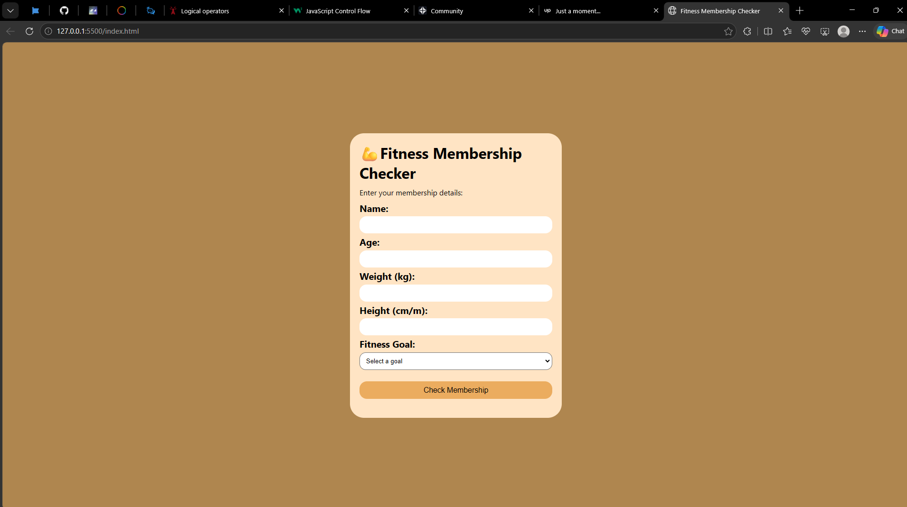

### Fitness Membership Checker

A simple gym membership checker built with HTML, CSS, and JavaScript.

This project allows users to enter their weight and height, calculates their Body Mass Index (BMI), and displays their BMI category.

## Features

* Accepts the user's weight
* Accepts the user's height in meters
* Calculates BMI automatically
* Displays the user's BMI result
* Categorizes the result as:

  * Underweight
  * Normal weight
  * Overweight
* Provides a simple and user-friendly interface

## Technologies Used

* HTML
* CSS
* JavaScript

## What I Learned

* How to collect user input using `.value`
* How to convert user input into numbers
* How to perform mathematical calculations with JavaScript
* How to use `if / else if / else` statements for decision-making
* How to use variables to store and work with data
* How to display results dynamically on a webpage
* How to debug and fix errors in my JavaScript logic
* How to build a small real-world application from scratch

## BMI Formula

The project calculates BMI using the following formula:

**BMI = Weight (kg) / Height² (m)**

For example:

```
Weight = 70 kg
Height = 1.75 m

BMI = 70 / (1.75 × 1.75)
BMI ≈ 22.86
```

## BMI Categories

| BMI         | Category      |
| ----------- | ------------- |
| Below 18.5  | Underweight   |
| 18.5 – 24.9 | Normal weight |
| 25 – 29.9   | Overweight    |

## Preview



## How to Run

1. Clone this repository.
2. Open the project folder in VS Code.
3. Open `index.html` in your browser.
4. Enter your weight in kilograms.
5. Enter your height in meters.
6. Click the button to check your BMI.

## Project Purpose

This project was built as part of my journey learning JavaScript and software development.

The goal was to practice taking user input, processing data, applying conditional logic, and displaying the result dynamically on a webpage.

## Author

**Efeose Isibor**

Learning, building, and improving one project at a time. 🚀
